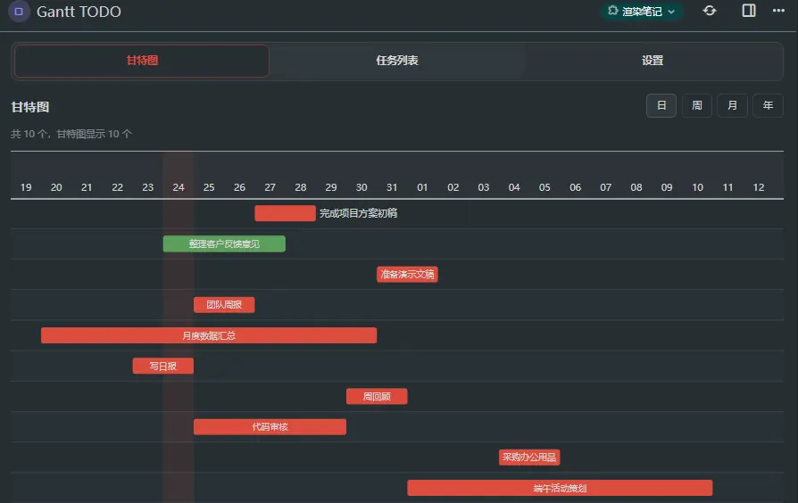
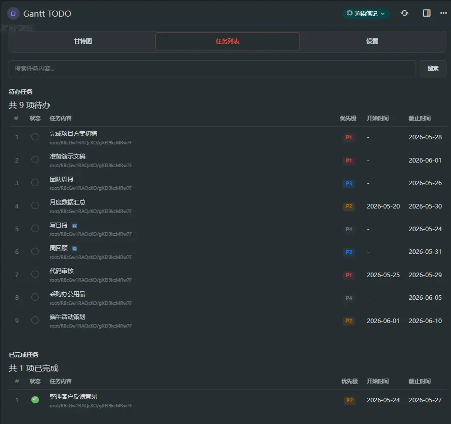

<!-- 本文件是中文版，英文版见 readme.md -->

> 📖 本文档为中文版，英文版见 [readme.md](readme.md)。

# Gantt TODO 面板 — Trilium 甘特图任务管理

## 概述

Trilium 内置的待办列表虽然支持任务标记语法（`#日期`、`#P1`–`#P4`、`#Follow-up`、重复任务），但缺乏一个可视化面板来一览所有笔记中的任务进度和时间线。

本插件在 Trilium 前端展示页面下增加了一个 **Gantt TODO 面板**，从指定笔记中收集 TODO 任务，解析任务标记，并以三种视图展示：

### 标签一：甘特图
- 使用 [Frappe Gantt](https://github.com/frappe/gantt) 库将所有带日期的任务以时间线展示
- 支持日 / 周 / 月 / 年视图切换
- 点击任务条跳转到来源笔记
- 进度条反映完成状态
- 自动适配 Trilium 亮暗主题
- **筛选** — 按所属笔记筛选任务
- **排序** — 按优先级（高→低/低→高）、开始时间、截止时间排序
- **隐藏已完成** — 切换显示/隐藏已完成任务



### 标签二：任务列表
- **筛选** — 按任务内容文字搜索
- **排序** — 点击表头（#、状态、内容、所属笔记、优先级、开始时间、截止时间）排序
- **分页** — 可调页大小（10/20/30/50/100）
- **复选框切换** — 勾选完成任务，取消勾选恢复待办
- **已完成区域** — 已完成任务单独展示，可取消完成
- **所属笔记** — 点击笔记标题可跳转到对应笔记



### 标签三：设置
- **收集范围** — 指定从哪些笔记（ID）中收集任务
- **自动刷新** — 数据自动刷新间隔
- **历史保留** — 限制重复任务历史记录数量
- **过期优先** — 开关过期任务优先排序

## 安装指南

### 方式一：手动复制文件

1. 在 Trilium 中打开 `nlKR1j0QzfmS`（前端展示页面）笔记
2. 在该笔记下创建以下结构：

```
Gantt TODO（render 类型）
  └── ~renderNote → GanttTodoTemplate（code, mime: text/html）
                      ├── GanttTodoBackend（code, mime: application/javascript;env=frontend）
                      └── GanttTodoScript（code, mime: application/javascript;env=frontend）
```

3. 将 `gantt-todo-template.html` 的内容复制到 **GanttTodoTemplate** 笔记
4. 将 `gantt-todo-backend.js` 的内容复制到 **GanttTodoBackend** 笔记
5. 将 `gantt-todo-script.js` 的内容复制到 **GanttTodoScript** 笔记
6. 为 **Gantt TODO** 笔记设置 `~renderNote` 关系指向 **GanttTodoTemplate**

### 方式二：发布页面下载压缩包并导入

从 [GitHub Releases](https://github.com/YuZhang/trilium-gantt-todo/releases) 页面下载最新版压缩包，在 Trilium 中通过 `导入` → `从 ZIP 文件导入` 导入即可自动创建完整笔记结构。

## 使用方法

1. 从前端展示页面 (`nlKR1j0QzfmS`) 打开 **Gantt TODO** 面板
2. 进入 **设置** 标签
3. 在"任务收集范围"中输入一个或多个笔记 ID（用空格分隔）— 会从这些笔记及其所有子笔记中收集任务
4. 点击 **保存设置**
5. 切换到 **甘特图** 或 **任务列表** 查看任务

### 任务语法参考

笔记中的任务使用标准 Trilium todo-list 语法，配合以下标记：

| 语法                      | 含义                   | 示例            |
| ------------------------- | ---------------------- | --------------- |
| `#YYYY-MM-DD`             | 截止日期（结束日期）   | `#2026-05-28`   |
| `#S-YYYY-MM-DD`           | 开始日期               | `#S-2026-05-24` |
| `#E-YYYY-MM-DD`           | 结束日期（显式）       | `#E-2026-06-01` |
| `#P1` ~ `#P4`             | 优先级（1最高，4最低） | `#P1`           |
| `#Follow-up`              | 标记为后续跟进         | `#Follow-up`    |
| `#every n day/week/month` | 重复任务               | `#every 1 day`  |

示例：
```markdown
- [ ] 写日报 #2026-05-24 #every 1 day #P4
- [ ] 代码审核 #S-2026-05-25 #E-2026-05-29 #P1 #Follow-up
- [ ] 月度汇总 #S-2026-05-20 #E-2026-05-30 #P2
```

勾选重复任务后，会自动生成下一次任务，已完成的历史记录会折叠到子任务列表中。

## 架构说明

### 笔记结构

```
nlKR1j0QzfmS（前端展示页面）
  ├── Gantt TODO（render）──renderNote──→ GanttTodoTemplate
  └── GanttTodoTemplate（code/text/html）
       ├── GanttTodoBackend（position 10）— 后端数据操作
       └── GanttTodoScript（position 20）— 前端 UI 渲染
```

### 模块系统

Trilium 将 `render`/`code` 笔记的子笔记作为 CommonJS 模块加载。**笔记标题**即为模块名：

```javascript
// GanttTodoBackend — 导出函数
module.exports = { runBackendAction };

// GanttTodoScript — 导入兄弟模块
const { runBackendAction } = GanttTodoBackend;
```

子笔记按 **position 顺序**加载（值小者先加载）。Position 10（后端）先于 Position 20（脚本）加载。

### 数据流程

```
用户打开面板 → init() → cacheDom() → loadTasks()
  → runBackendAction('fetchTasks', {rootNoteIds: [...]})
    → api.runOnBackend(fn, [action, payload])   ← 在 Trilium 服务端执行
      → 1. 从每个根 ID 递归遍历笔记树
      → 2. 对每个 text 笔记，用 Cheerio 解析 HTML
      → 3. 查找 <ul class="todo-list"> 待办项
      → 4. 提取描述文本，解析标记（日期、优先级、重复、跟进）
      → 5. 返回结构化任务对象数组
    → 前端渲染甘特图 / 任务列表 / 设置
```

### 所用 API

| API                                | 用途                                 |
| ---------------------------------- | ------------------------------------ |
| `api.runOnBackend(callback, args)` | 在后端执行操作（任务收集、完成切换） |
| `api.getNote(noteId)`              | 按 ID 获取笔记（后端）               |
| `api.dayjs()`                      | 日期解析与格式化（后端）             |
| `api.cheerio.load(html)`           | 解析笔记 HTML 内容（后端）           |
| `Buffer.isBuffer(content)`         | 处理二进制笔记内容（后端）           |
| `api.activateNote(noteId)`         | 点击任务跳转到来源笔记               |
| `localStorage`                     | 存储设置（前端）                     |
| `api.searchForNotes(query)`        | 按类型搜索笔记（后备方案）           |

### 任务标记解析

后端 `parseTaskMeta()` 函数通过正则从任务描述文本中提取结构化数据：

1. 剥离所有标记 token（`#S-日期`、`#E-日期`、`#P1`–`#P4`、`#Follow-up`、`#every n 单位`）
2. 剩余文本成为任务显示文本
3. 提取的标记填充到 `startDate`、`endDate`、`priority`、`followUp`、`repeat` 字段

## 开发相关

### 文件说明

| 文件                       | 用途                                   |
| -------------------------- | -------------------------------------- |
| `gantt-todo-template.html` | HTML 模板 + CSS（render 笔记内容）     |
| `gantt-todo-backend.js`    | 后端模块（任务收集、解析、完成、重复） |
| `gantt-todo-script.js`     | 前端模块（UI 渲染、事件、设置）        |
| `readme.md`                | 英文文档                               |
| `readme_zh.md`             | 本文件（中文文档）                     |

### 依赖

- **Frappe Gantt** (v0.6.1) — 从 CDN 加载 (`cdn.jsdelivr.net`)，用于甘特图渲染
- **Trilium 内置 API** — `api.dayjs`、`api.cheerio`、`api.runOnBackend`、`api.getNote`

## 已知问题

- 甘特图日/周视图需要带时间的日期格式（ISO `T` 分隔符）
- Frappe Gantt CDN 需可访问；如被 CSP 拦截，甘特图显示加载失败提示
- 设置中"任务收集范围"为必填 — 空范围时显示引导提示，不会搜索全部笔记

## 许可

MIT
